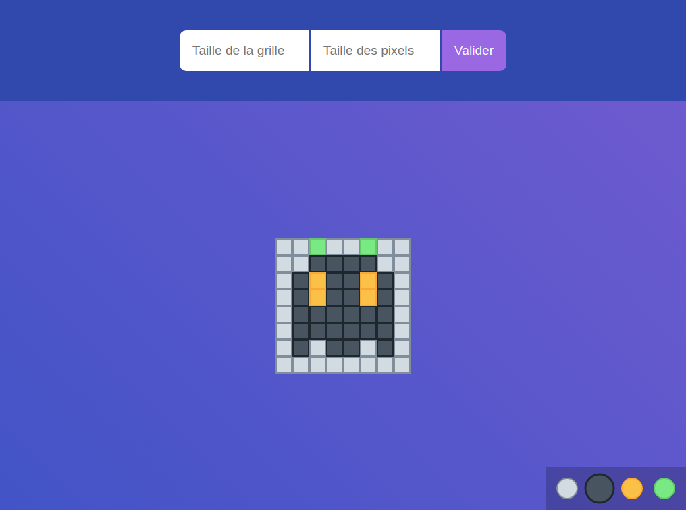

# Invader

:black_square_button::black_square_button::black_square_button::black_square_button::black_square_button::black_square_button::black_square_button::black_square_button::black_square_button:  
:black_square_button::black_square_button::white_square_button::white_square_button::white_square_button::white_square_button::white_square_button::black_square_button::black_square_button:  
:black_square_button::black_square_button::white_square_button::large_orange_diamond::white_square_button::large_orange_diamond::white_square_button::black_square_button::black_square_button:  
:black_square_button::white_square_button::white_square_button::white_square_button::white_square_button::white_square_button::white_square_button::white_square_button::black_square_button:  
:black_square_button::black_square_button::white_square_button::black_square_button::white_square_button::black_square_button::white_square_button::black_square_button::black_square_button:  
:black_square_button::white_square_button::black_square_button::black_square_button::white_square_button::black_square_button::black_square_button::white_square_button::black_square_button:  
:black_square_button::black_square_button::black_square_button::black_square_button::black_square_button::black_square_button::black_square_button::black_square_button::black_square_button:

Au programme :space_invader: : concevoir une application JavaScript pour créer une ardoise de dessin en pixel art dans le style du célèbre jeu [Space Invaders](https://fr.wikipedia.org/wiki/Space_Invaders).

## Étape 1 - Générer l'ardoise

## Étape 2 - Gérer le clic sur un pixel

## Étape 3 - Formulaire de configuration
